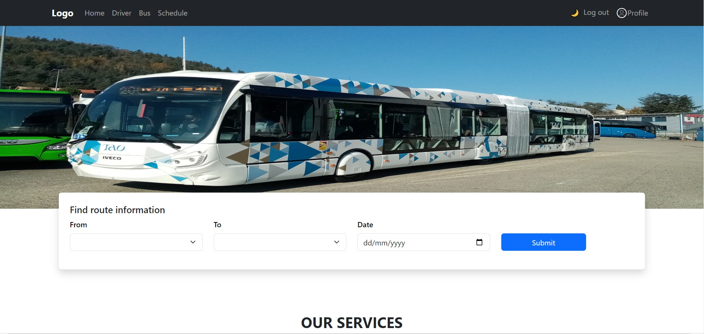
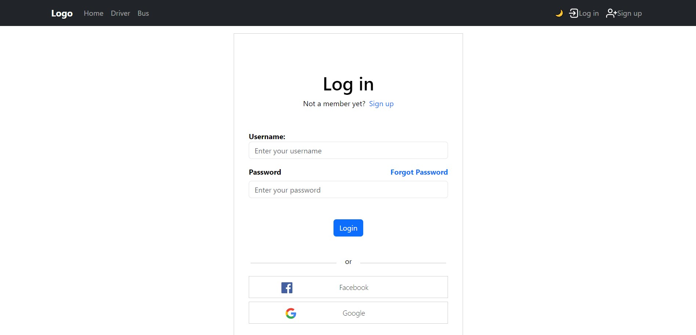
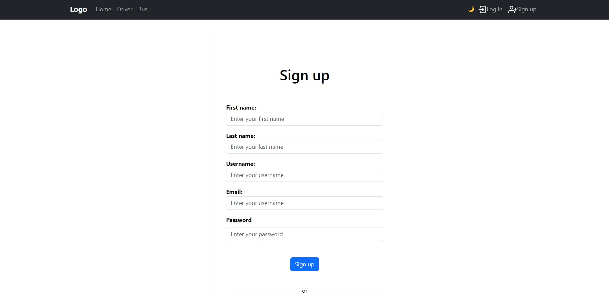
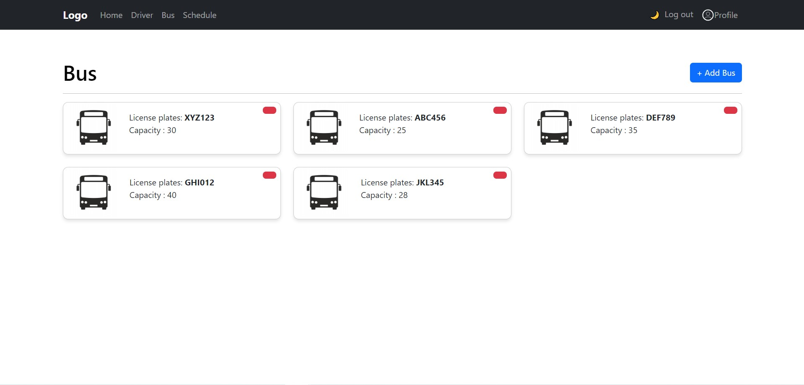
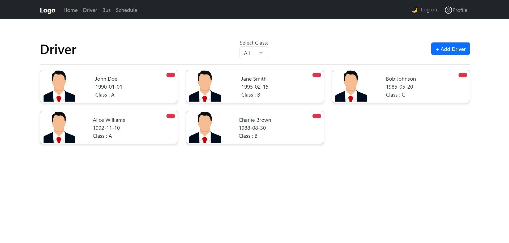
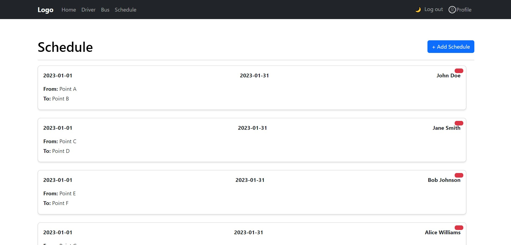
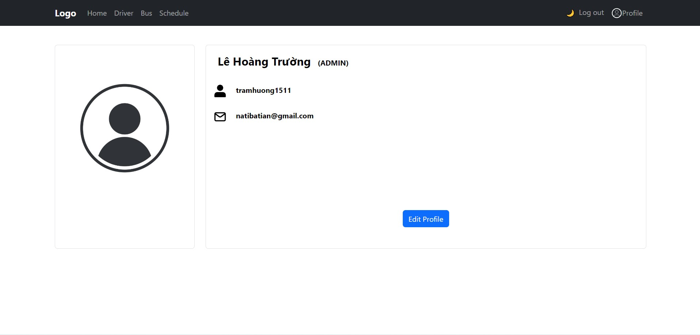

# BusGo
App to manage buses for private transport companies

## Description

This is a website that helps users find information about bus stations, routes, and bus schedules. It provides an easy way to access public transportation information using the internet.

## Technology Stack

BusGo utilizes a robust technology stack:

- **Frontend**: [Vue.js](https://vuejs.org/)
- **Backend**: [Django](https://www.djangoproject.com/)
- **Database**: [SQLite3](https://www.sqlite.org/)

## Features

### 1. Bus Station Lookup

BusGo allows users to search and view detailed information about bus stations in their area. Users can search by station name or geographical location.

### 2. Route Lookup

Users can look up information about bus routes, including destinations, schedules, and frequency of operation.

### 3. Bus Schedule

BusGo provides detailed schedules for bus services, helping users plan their journeys conveniently.

### 4. Register new user

BusGo allows users to create new accounts, providing them with personalized features such as saving favorite routes, setting preferences, and receiving updates on service changes. 

## Demo
### Home Page

### Log In Page

### Sign Up Page

### Bus Page

### Driver Page

### Schedule Page

### Profile Page

## Contact Information

For inquiries or assistance, please contact us at [natibatian@gmail.com](mailto:natibatian@gmail.com).
